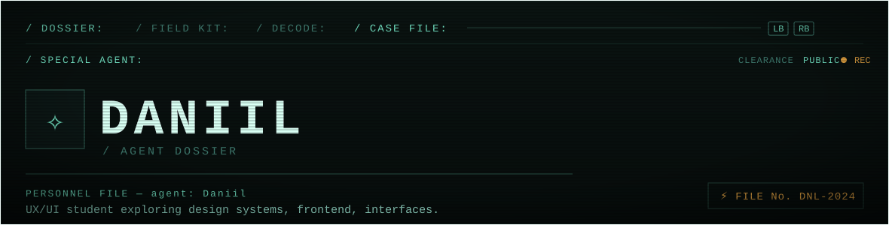

 

### `/ DOSSIER`

<!-- Animated typewriter line — matches the field-notes typing in the prototype -->

 

### `/ FIELD KIT`  ·  standard issue

 

### `/ DECODE`  ·  evidence breakdown

<!-- Top languages card, themed -->

 
 

### `/ SURVEILLANCE`  ·  live GitHub relay

<table>
<tr>
<td width="50%">

</td>
<td width="50%">

</td>
</tr>
</table>

<!-- Contribution activity graph — the "intercept feed" line trace -->

 

<!-- footer line -->
`DANIIL / GITHUB / DOSSIER` · clearance PUBLIC · file No. DNL-2024
